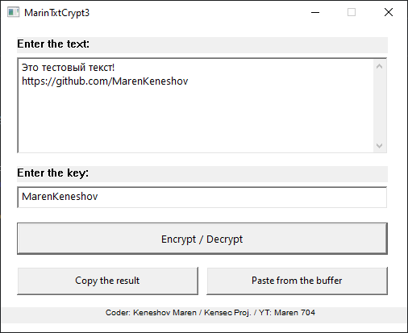

**RUS**

### MarinTxtCrypt3

 

Программа для шифрования и дешифрования текста с использованием XOR-алгоритма и Base64-кодирования. Интерфейс построен на основе Windows API. Приложение позволяет шифровать текст с использованием пользовательского ключа и копировать/вставлять зашифрованный или расшифрованный текст через буфер обмена.

#### Основные особенности:

* **Шифрование и дешифрование текста:** Использует алгоритм XOR с пользовательским ключом.
* **Поддержка Base64:** Защищённый текст кодируется в формат Base64, чтобы предотвратить потерю данных при передаче.
* **Интерфейс на основе Windows API:** Простое и интуитивно понятное окно с кнопками для шифрования/дешифрования текста, а также копирования и вставки текста.
* **Горячие клавиши:** Быстрое управление с помощью горячих клавиш Ctrl + A (выделить), Ctrl + C (копировать), Ctrl + V (вставить).
* **Поддержка UTF-8:** Текст автоматически преобразуется между форматами UTF-8 и Unicode.

#### Как использовать:

1. Введите текст и ключ для шифрования/дешифрования.
2. Нажмите "Encrypt / Decrypt" для обработки текста.
3. Используйте кнопки "Copy the result" и "Paste from the buffer" для работы с буфером обмена.

#### Требования:

* Windows

#### ДЕМО-ВИДЕО ЕСТЬ В МОЁМ ТГ-КАНАЛЕ: t.me/kensecproj

------------------------------------------------------------------------------------------------------------------------------------------------------------------------------------------

**ENG**

### MarinTxtCrypt3

 

A program for encrypting and decrypting text using the XOR algorithm and Base64 encoding. The interface is based on the Windows API. The application allows you to encrypt text using a user key and copy/paste encrypted or decrypted text via the clipboard.

#### Main features:

* **Text encryption and decryption:** Uses the XOR algorithm with a user-defined key.
* **Base64 support:** Protected text is encoded in Base64 format to prevent data loss during transmission.
* **Windows API-based interface:** A simple and intuitive window with buttons for encrypting/decrypting text, as well as copying and pasting text.
* **Hotkeys:** Quick control using hotkeys Ctrl + A (select), Ctrl + C (copy), Ctrl + V (paste).
* **UTF-8 support:** Text is automatically converted between UTF-8 and Unicode formats.

#### How to use:

1. Enter the text and key for encryption/decryption.
2. Click “Encrypt / Decrypt” to process the text.
3. Use the “Copy the result” and “Paste from the buffer” buttons to work with the clipboard.

#### Requirements:

* Windows

#### THERE IS A DEMO VIDEO IN MY TG-CHANNEL: t.me/kensecproj
